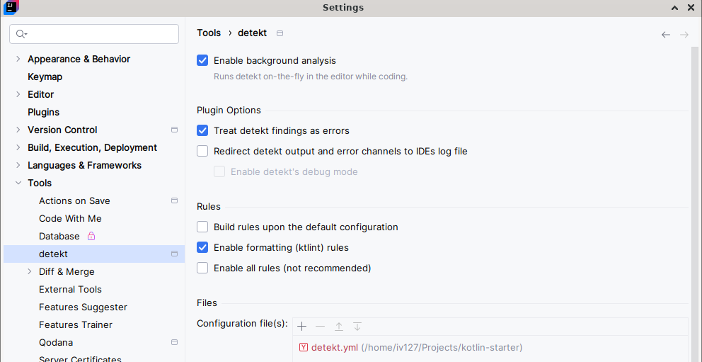

# Kotlin Starter

## Description

A starter Kotlin project.

## Prerequisites

- IntelliJ **detekt** plugin
  - Enable: Settings -> Tools -> detekt
  - 
- Disable wildcard imports: Settings -> Editor -> Code Style -> Kotlin
- New line at the end of the file: Settings -> Editor -> General -> Ensure every saved file ends with a line break

## Shell

```sh
./gradlew run

# automatically part of the check step
./gradlew detekt

./gradlew ktlintFormat
./gradlew ktlintCheck
```

## Info

- To handle manually versions of JDKs on Windows, use <https://github.com/shyiko/jabba>
- If the main method isn't inside a class, the `Kt` suffix is required, e.g., `mainClass.set("com.iv127.kotlin.starter.MainKt");` where `Main` is the name of the source file. Otherwise, if the `main` method is inside the `Main` class, then `mainClass.set("com.iv127.kotlin.starter.Main")`
- run via gradle: `./gradlew run` which will use `main` defined in `application`, see `build.gradle.kts`
- **Platform type** - type that potentially can be null, but bypasses compile-time null-check, e.g. calling java method that returns ref to an object
  - Platform types essentially mean “I’ll allow you to pass this thing, which might be
null, to a non-nullable type.”
  - **Kotlin will fail early here as well. Kotlin adds runtime checks to all
variable and property assignments where the type is non-nullable.** Kotlin will throw an error on assignment, so in the end, the variable will indeed be non-nullable.
- **Elvis operator** is a convenient way to specify a default value
when something is `null` or false, e.g. `var test = nullable ?: default`
- For `prod` env if env variable `APPLICATION_HTTP_PORT` is not specified, `com.typesafe.config` will fail
- Nix shell with all settings and env variables; `nix-shell ./app.nix --run bash`
- Prefixing application specific environment variables is a good practice
- Data classes has built-in copy functions
- Kotlin HOFs (high order functions):
  - `also` works as `Stream.map`, but it returns same type and value that it takes
  - `let` method woks like `Stream.map` in java (see `KotlinLetUsageTest`). On nullable is executed ONLY if value is present
  - `fold` works like `reduce` in js or `collect` in java, accumulator can be of any type
  - `use` for classes that implement `Closeable`, in the end calls `close` even if exception is thrown in the block
  - `apply` runs initialization logic after object was created
- **Extension Function** - invoke the
function as if it were a method defined on the class itself, see `com.iv127.kotlin.starter.StringExtensionFunctionTest`
- A lambda with receiver is a special kind of lambda where you can call methods and access properties of a receiver object directly inside the lambda, without specifying it explicitly, see `com.iv127.kotlin.starter.StringExtensionFunctionTest`
- > benchmarks and real-world
experience have shown that in some cases, you’ll get more performance out of your
database if you limit the maximum allowed number of simultaneous connections to
about half the maximum of what the database supports*
- `javax.sql.DataSource` is an abstraction over connection pool
- DB interaction, briefly:
  - create connection or get connection from `DataSource`
  - create statement
  - statement.executeSql
  - process result set
- `Connection` is closeable
  - If the connection was created manually, `close` disconnects it.
  - If the connection was obtained from the connection pool, `close` returns it to the pool.
- **function reference** e.g. `::migrateDataSource`
- Flyway migration name pattern `V{number}__{myFileName).sql`
- Flyway repeatable migration name pattern `R__{myFileName}.sql` which always runs
- > blue/green deployments, meaning that when you
deploy the latest version of your code, you keep the previous version up and running
until the process with your new code has started up and is fully initialized.
- It is important to make migrations backward compatible for blue-green deployments
- **Seed Data** - data that web app
expects to always be in the database
- **Rerunning Failed Migration**
  - Make manual changes
  - To make Flyway believe a migration never ran, update the `flyway_schema_
history` table. Assuming the
migration that failed was V5, run `DELETE FROM flyway_schema_history WHERE
version = 5` to make Flyway rerun the migration from scratch next time on app startup.
- **Manually Performing Migration**
  - Make manual changes
  - `UPDATE flyway_schema_history SET
success = true WHERE version = 5` on startup, Flyway will think that the migration was already run
- Cast from `Long?` to `Long`, e.g. `return userId!!`, if userId is null it will throw NPE
- > "black box tests"
signifying that your tests have as little knowledge as possible about the inner workings of
the system under test
- testing hierarchy: unit, integration, system, acceptance (E2E)
- **Function type with receiver** is a function definition like `Application.() -> Unit`, where inside the body it is possible to use `this` of the Application type.
- **TODO** The difference between kotlin.coroutines and kotlinx.
coroutines

141

## API Usage

```sh
curl -i -X GET http://0.0.0.0:8081/ ; echo -e '\n'

curl -i -X GET http://0.0.0.0:8081/param_test?foo=abc123 ; echo -e '\n'

curl -i -X GET http://0.0.0.0:8081/json_test ; echo -e '\n'

curl -i -X GET http://0.0.0.0:8081/json_test_with_header ; echo -e '\n'

curl -i -X GET http://0.0.0.0:8081/err ; echo -e '\n'

curl -i -X GET http://0.0.0.0:8081/db_test1 ; echo -e '\n'

curl -i -X GET http://0.0.0.0:8081/db_test2 ; echo -e '\n'

curl -i -X GET http://0.0.0.0:8081/single_user ; echo -e '\n'
```

## TODO

- none

## Nested transaction using kotliquery

Kotliquery doesn't support nested transactions, but it can be achieved through save-points

```kt
private fun webResponseTx(
    dataSource: DataSource,
    handler: suspend PipelineContext<Unit, ApplicationCall>.(
        dbSess: TransactionalSession
    ) -> WebResponse
) = webResponseDb(dataSource) { dbSess ->
    dbSess.transaction { txSess ->
        handler(txSess)
    }
}

fun <A>dbSavePoint(dbSess: Session, body: () -> A): A {
    val sp = dbSess.connection.underlying.setSavepoint()
    return try {
        body().also {
            dbSess.connection.underlying.releaseSavepoint(sp)
        }
    } catch (e: Exception) {
        dbSess.connection.underlying.rollback(sp)
        throw e
    }
}

fun test() {
  sessionOf(dataSource).use { dbSess ->
      dbSess.transaction { txSess ->
          dbSavePoint(txSess) {
              txSess.update(queryOf("INSERT INTO ...")) // main transaction won't fail if this piece fails
          }
      }
  }
}
```

## Access modifiers (Java vs. Kotlin)

| Java           | Kotlin         |
|----------------|----------------|
| public         | public (default) |
| protected      | protected      |
| (no modifier)  | internal       |
| private        | private        |

## References

- Lilleaas, A. (2023). *Pro Kotlin Web Apps from Scratch*.
- <https://kotlinlang.org/docs/sealed-classes.html>
- <https://codezup.com/dockerizing-kotlin-application-step-by-step-guide/>
- <https://flywaydb.org/>
- <https://www.baeldung.com/kotlin/detekt-static-code-analysis>
- <https://hofstede-matheus.medium.com/improve-code-quality-with-ktlint-detekt-and-git-hooks-d173722594e4>
